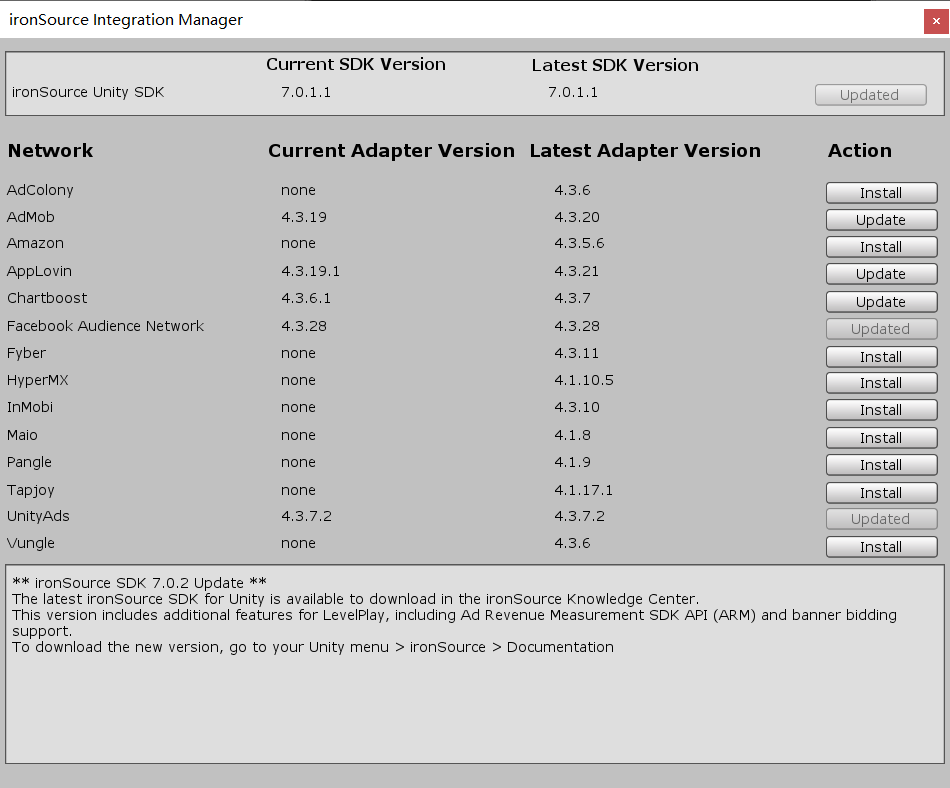
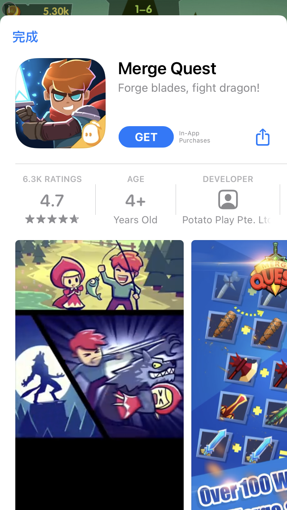

# information
## device
iphone 6(ios 12.4.8) iphone7(ios 14.2)
## SDK Version

## bug ad

## video
play_ad_bug_video.mp4 or  
[video](https://youtu.be/lWUefuP-bEs)

## description
It happens like this, if my next Reward ad is this ad, it will automatically run in the background.  
The first half of the video shows that it played automatically. At this time, I was still playing the game normally. In the second half of the video, when I actively played the advertisement, it was followed by this sound.